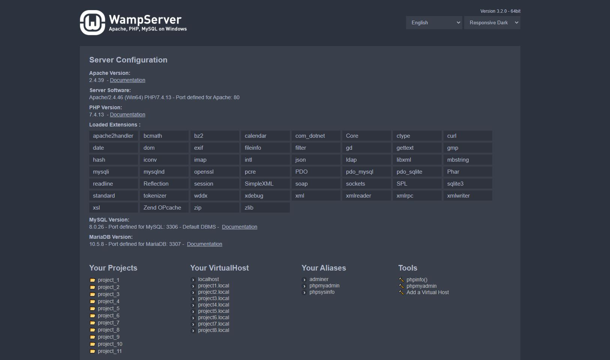
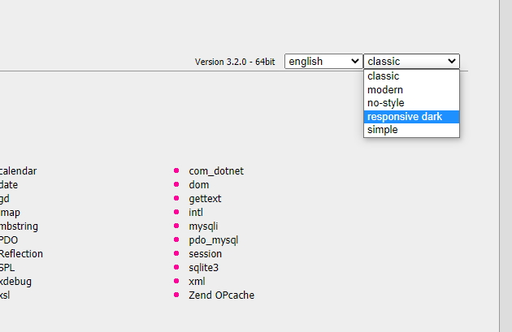

## WampServer Responsive Dark Theme
A responsive dark CSS theme for the WampServer index page.<br><br>


## How to use
- Download the Responsive Dark folder.
- Place it in the ```wampthemes``` folder located in the ```www``` folder of your WampServer installation.
- Select the theme on the top-right corner of the index page of your WampServer:<br><br>
